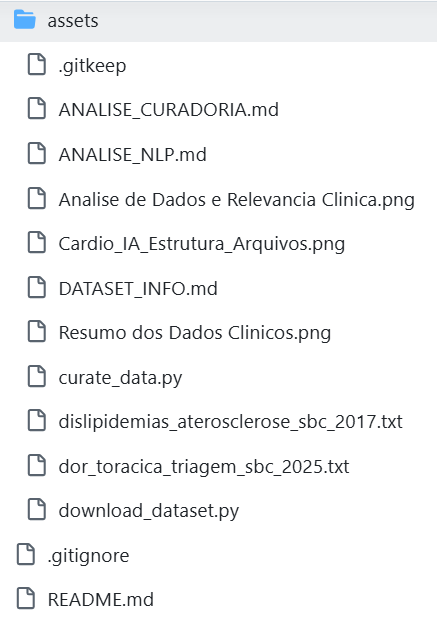
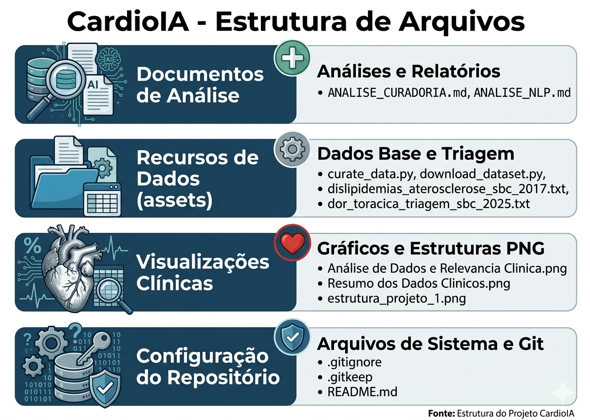

  

---

## 🩺 FIAP - CardioIA | Fase 1 — Batimentos de Dados

## Ecossistema Inteligente de Cardiologia com Inteligência Artificial

Projeto acadêmico desenvolvido na FIAP com foco na construção de uma base de dados multimodal para aplicações de Inteligência Artificial em saúde cardiovascular.

---

# 👥 Integrantes da Equipe

| Nome completo     | RM       |  FUNÇÃO                                  |
|:-----------------:|:--------:|:----------------------------------------:|
| Carlos            | RM566487 |  Arquiteto de Dados e Governança         |
| Endrew            | RM563646 |  Especialista em Visão Computacional     |
| João              | RM565999 |  Especialista em IoT e Dados Estruturados|
| Tayna             | RM562491 |  Analista de NLP                         |

---

# Introdução

As doenças cardiovasculares permanecem entre as principais causas de mortalidade no mundo, representando um dos maiores desafios para os sistemas de saúde modernos. O diagnóstico precoce, o monitoramento contínuo e a análise integrada de dados clínicos são fatores essenciais para reduzir riscos, melhorar prognósticos e otimizar o tratamento de pacientes.

Nesse contexto, a **Inteligência Artificial (IA)** surge como uma poderosa ferramenta capaz de transformar grandes volumes de dados médicos em conhecimento útil para apoio à decisão clínica. Técnicas como **Machine Learning, Processamento de Linguagem Natural, Visão Computacional e análise de dados provenientes de sensores e dispositivos IoT** permitem identificar padrões complexos que muitas vezes não são perceptíveis em análises tradicionais.

O projeto **CardioIA** foi concebido com o objetivo de explorar esse potencial tecnológico na área da cardiologia. A iniciativa busca construir um ecossistema inteligente capaz de integrar diferentes tipos de dados clínicos — estruturados, textuais e visuais — para apoiar futuras aplicações de IA voltadas ao diagnóstico, monitoramento e análise de risco cardiovascular.

Esta etapa do projeto, denominada **Fase 1 — Batimentos de Dados**, tem como objetivo principal **identificar, coletar, organizar e documentar os conjuntos de dados que servirão como base para as próximas fases do sistema CardioIA**.

Nesta fase, a equipe assume o papel de **cientistas e arquitetos de dados hospitalares**, responsáveis por estruturar três pilares fundamentais de informação:

- **Dados Numéricos (IoT / Dados Estruturados)**: variáveis clínicas e biométricas utilizadas para modelagem preditiva.
- **Dados Textuais (NLP)**: diretrizes médicas e literatura clínica utilizadas para extração de conhecimento em linguagem natural.
- **Dados Visuais (Visão Computacional)**: imagens médicas que poderão ser utilizadas na detecção automática de padrões cardíacos.

Mais do que simplesmente coletar dados, esta fase enfatiza aspectos fundamentais de projetos de Inteligência Artificial em saúde, como:

- qualidade e confiabilidade dos dados
- rastreabilidade das fontes
- diversidade das amostras
- privacidade e anonimização
- identificação de possíveis vieses

Esses princípios são essenciais porque, em projetos de IA, **a qualidade e governança dos dados são fatores determinantes para a confiabilidade dos modelos desenvolvidos**.

---

# 🎯 Objetivo do Projeto

Construir a **base de dados multimodal** que permitirá o desenvolvimento futuro de modelos de Inteligência Artificial aplicados à cardiologia.

O projeto integra três tipos principais de dados:

1. **Dados Numéricos** — variáveis clínicas estruturadas
2. **Dados Textuais** — literatura médica e diretrizes clínicas
3. **Dados Visuais** — imagens de exames cardíacos

Essa integração permite a construção de **sistemas de IA multimodais**, capazes de combinar diferentes fontes de informação para apoiar análises clínicas mais completas.

---

# 📂 Estrutura do Repositório

<table align="center">
<tr>

<td align="center">

</td>

<td align="center">

</td>

</tr>
</table>
 
A pasta **assets** contém materiais auxiliares utilizados no projeto, como textos clínicos e documentação técnica.

---

# 🔢 Dados Numéricos (Dados Estruturados Clínicos)

## Dataset: Heart Disease UCI — Cleveland Database

O dataset principal utilizado nesta fase é o **Heart Disease Dataset**, disponibilizado pelo UCI Machine Learning Repository.

Esse conjunto de dados contém registros clínicos de pacientes avaliados quanto à presença de doença cardíaca, sendo amplamente utilizado em pesquisas de Machine Learning.

**Fonte Oficial:**  
http://archive.ics.uci.edu/ml/datasets/Heart+Disease

**Acesso ao Dataset utilizado no projeto:**  
https://drive.google.com/drive/folders/1Is49Rh1D4fKgtgbgTN8u_KIuI2xLp5At

---

# 📊 Características do Dataset

- **Número de pacientes:** 303
- **Número de variáveis:** 14
- **Formato:** CSV
- **Licença:** Creative Commons
- **Tipo de dados:** Dados clínicos anonimizados

---

# 🏥 Análise de Dados e Relevância Clínica

  

---

# 🧠 Importância das Variáveis para Machine Learning

Modelos de Machine Learning conseguem identificar **relações complexas entre múltiplos fatores clínicos**, permitindo:

- detecção de padrões não lineares
- estratificação de risco cardiovascular
- identificação de combinações críticas de variáveis
- suporte a análises preditivas

Por exemplo, um paciente jovem com colesterol elevado pode apresentar risco semelhante ao de um paciente mais velho com outros fatores de risco associados. A análise integrada dessas variáveis permite que algoritmos de IA capturem essas interações.

---

# 📈 Estatísticas do Dataset

  

---

# 🧹 Curadoria e Preparação dos Dados

Durante a preparação do dataset foram realizadas as seguintes etapas:

- download automatizado do dataset
- validação do número mínimo de registros
- verificação das colunas obrigatórias
- identificação de valores ausentes
- padronização da variável target

Essas etapas garantem maior confiabilidade para futuras análises e treinamentos de modelos de IA.

---

# 📚 Processamento de Linguagem Natural (NLP)

Para complementar os dados estruturados, o projeto utiliza textos clínicos provenientes de **diretrizes médicas da Sociedade Brasileira de Cardiologia**.

Documentos utilizados:

- Diretriz Brasileira de Atendimento à Dor Torácica na Emergência (2025)
- Diretriz de Dislipidemias e Prevenção da Aterosclerose (2017)

Esses documentos foram convertidos para formato `.txt` para permitir aplicações futuras de NLP, como:

- extração automática de sintomas
- identificação de fatores de risco
- classificação de risco clínico
- apoio à triagem médica baseada em texto

---

# Corpus Clínico para NLP

Arquivos disponíveis na pasta `assets`:

- `dor_toracica_triagem_sbc_2025.txt`
- `dislipidemias_aterosclerose_sbc_2017.txt`

Esses textos servem como base de conhecimento para aplicações futuras de Processamento de Linguagem Natural.

---

# 🖼️ Dados Visuais (Visão Computacional)

O projeto também inclui um conjunto de **imagens de eletrocardiograma (ECG)** organizadas em diferentes categorias clínicas:

- ECG Normal
- ECG com Infarto do Miocárdio
- ECG com Batimentos Anormais
- ECG com Histórico de Infarto

Essas imagens podem ser utilizadas para treinamento de modelos de **Redes Neurais Convolucionais (CNN)** capazes de detectar padrões cardíacos.

Aplicações potenciais:

- classificação automática de ECG
- detecção de arritmias
- identificação de sinais de infarto

Dataset de imagens:  
https://drive.google.com/drive/folders/1w-R_bxDKnD9HdZfJi5lZGQh3VTF0AJ3u

---

# ⚖️ Governança de Dados e Viés

Projetos de Inteligência Artificial aplicados à saúde exigem atenção especial à **governança de dados**, garantindo que os dados utilizados sejam confiáveis, rastreáveis e eticamente adequados.

## Princípios adotados no projeto

O CardioIA adota três princípios fundamentais de governança:

**Rastreabilidade**

Todas as fontes de dados utilizadas são documentadas, permitindo identificar a origem, o contexto de coleta e as condições de uso.

**Transparência**

Os datasets utilizados são públicos e amplamente documentados, garantindo que outros pesquisadores possam reproduzir as análises realizadas.

**Adequação ao propósito**

Os dados são utilizados exclusivamente para **fins acadêmicos e educacionais**, não sendo destinados a aplicações clínicas reais.

---

## Diversidade dos Dados

O dataset Heart Disease apresenta diversidade em alguns aspectos importantes:

- pacientes de ambos os sexos
- ampla faixa etária (29–77 anos)
- diferentes perfis clínicos

Entretanto, como ocorre em muitos datasets médicos, existem limitações de representatividade, já que os dados foram coletados em instituições específicas.

Portanto, os resultados obtidos com modelos treinados nesses dados devem ser interpretados como **provas de conceito acadêmicas**, e não como modelos clínicos universais.

---

## Privacidade e Proteção de Dados

Todos os dados utilizados no projeto são **anonimizados e de acesso público**, não contendo informações que permitam identificar pacientes.

Não são utilizados:

- nomes
- documentos pessoais
- endereços
- informações sensíveis identificáveis

Essa abordagem garante conformidade com princípios da **Lei Geral de Proteção de Dados (LGPD)**.

---

## Possíveis Vieses em IA

Mesmo com dados anonimizados, é importante reconhecer que modelos de IA podem reproduzir vieses presentes nos dados.

Alguns possíveis pontos de atenção incluem:

- predominância de pacientes masculinos no dataset
- dados coletados em regiões específicas
- variações nos equipamentos médicos utilizados

Reconhecer essas limitações é fundamental para garantir que modelos desenvolvidos futuramente sejam interpretados com cautela.

---

# 🔗 Integração Multimodal de Dados

O projeto CardioIA propõe a integração de três tipos de dados clínicos:

| Tipo de Dados | Aplicação |
|--------|--------|
Dados estruturados | Modelos preditivos |
Texto clínico | NLP e extração de conhecimento |
Imagens médicas | Visão computacional |

Essa abordagem permite o desenvolvimento futuro de **modelos multimodais de IA**, capazes de combinar diferentes fontes de informação para apoiar decisões médicas.

---

# 📊 Status do Projeto

- Estruturação do repositório ✔
- Coleta de dados numéricos ✔
- Documentação do dataset ✔
- Curadoria de dados ✔
- Coleta de textos clínicos ✔
- Coleta de imagens ✔
- Documentação completa ⏳
- Validação final ⏳

---

# 🏫 Instituição

**FIAP — Faculdade de Informática e Administração Paulista**

Projeto acadêmico desenvolvido no contexto da disciplina de Inteligência Artificial aplicada a dados.

Ano: **2026**
